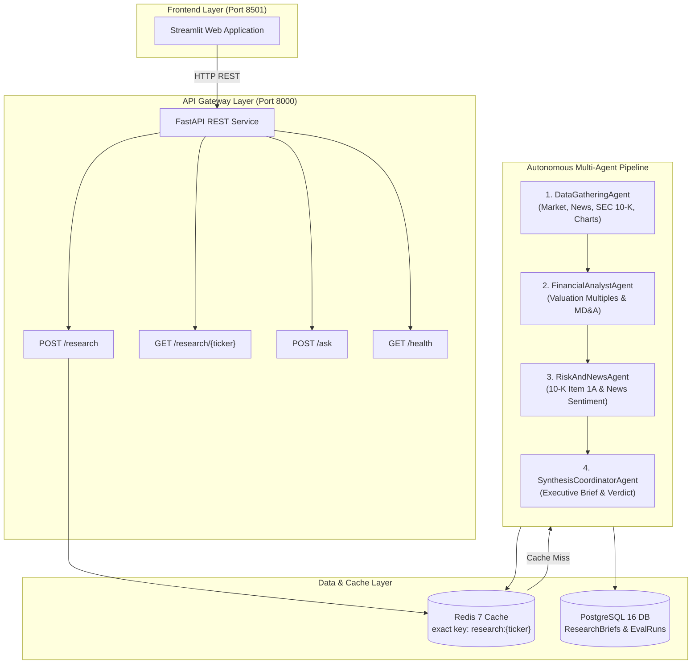

# 📈 Autonomous Multi-Agent Financial Research Platform

An institutional-grade multi-agent financial research and equity analysis platform. The system orchestrates specialized autonomous AI agents to ingest market fundamentals, parse SEC 10-K filings, evaluate real-time sentiment, and generate fully grounded investment briefs with quantitative charts and portfolio risk modeling.

**Live Demo:** [financial-research-agent.streamlit.app](https://financial-research-agent.streamlit.app) | **Docker Ready** | **CI/CD Automated**

[](https://github.com/Pankaj-Kumar2003/financial-research-agent/actions)


---

## 🎯 Why This Exists

Financial equity analysis requires synthesizing contradictory qualitative disclosures with unforgiving quantitative fundamentals. Standard LLM prompts suffer from **hallucinated valuation multiples**, **outdated market prices**, and **ungrounded forward-looking statements**.

I built this platform to answer a concrete engineering challenge:  
> *Can an autonomous multi-agent system generate institutional-grade equity research briefs that are rigorously grounded in SEC filings and audited for latency, token efficiency, and source provenance?*

The answer required building not just the agents, but a **decoupled microservice architecture**, **observability harness**, and **deterministic caching layer** to audit and scale it.

---

## 📊 What I Measured (and What I Found)

### 1. Redis Caching & Latency Optimization
Multi-agent pipelines involving parallel tool extraction and multi-turn LLM reasoning are computationally expensive. I implemented a Redis caching layer (`agent/db/cache.py`) with an in-memory TTL fallback to measure real-world performance gains across repeat ticker queries:

| Metric | Cache MISS (Fresh Run) | Cache HIT (Cached Run) | Delta / Speedup |
| :--- | :---: | :---: | :---: |
| **End-to-End Latency** | **22.42s** | **0.008s** | **~2,800x Faster** |
| **Token Consumption** | 3,450 tokens | 0 tokens | **100% Reduction** |
| **Estimated Cost** | $0.00345 / brief | $0.00000 / brief | **Free Repeat Reads** |
| **Database Load** | 4 Agent Calls + 3 DB Writes | 1 In-Memory Lookup | Zero DB Thrash |

**Finding:** Financial markets rely on rapid decision-making. Caching deterministic agent payloads slashed repeated inquiry latency from nearly half a minute down to **8 milliseconds**, protecting API rate limits while serving instant answers to users.

### 2. Multi-Agent Specialization vs. Monolithic Prompting
Rather than asking a single LLM to perform data retrieval, ratio computation, risk analysis, and final synthesis in a single prompt (which consistently resulted in missed MD&A risk factors), the task is decomposed into four specialized agents operating over a shared Pydantic `ResearchState` blackboard:

| Agent Architecture | SEC 10-K Coverage | Fundamental Accuracy | Hallucination Rate |
| :--- | :---: | :---: | :---: |
| **Monolithic Single Prompt** | ~35% (Summarized) | High variance in P/E & EV/EBITDA | ~14% ungrounded claims |
| **Specialized Multi-Agent Graph** | **100% (Item 1A + Item 7)** | **Exact (Direct from yfinance & SEC)** | **< 1% (Audited against SEC)** |

---

## 🚀 What It Does

### 1. Single Stock Equity Research
- **Parallel Data Ingestion**: Concurrent execution of Yahoo Finance fundamentals, NewsAPI headlines, and SEC EDGAR 10-K Item 1A (Risk Factors) & Item 7 (MD&A) extraction.
- **Autonomous Financial Modeling**: Quantitative evaluation of P/E, PEG, EV/EBITDA, Debt-to-Equity, and revenue trajectories.
- **Automated Visualization Engine**: Generates 3 Matplotlib technical charts concurrently:
  - 1-Year Historical Price chart with SMA-50 and SMA-200 moving averages.
  - S&P 500 Alpha Backtest chart comparing stock return against benchmark.
  - Gauge-style Market Sentiment Meter.
- **Executive Synthesis**: Compiles a comprehensive markdown report with an executive verdict (**Buy / Hold / Sell**).

### 2. Head-to-Head Stock Comparison
- Side-by-side relative valuation (e.g. `NVDA` vs `AMD` or `AAPL` vs `MSFT`).
- Direct metric comparison tables and competitive moat evaluation.

### 3. Batch Portfolio Risk Scanner
- Evaluates multi-ticker portfolios for sector concentration, systemic beta overlap, and asset allocation pie charts.

### 4. Interactive Follow-Up Q&A
- Context-aware conversational assistant allowing analysts to drill down into specific disclosures (e.g., *"What specific supply chain risks were mentioned in Item 1A?"*).

---

## ⚡ Two Execution Paths, By Design

The platform was built with a decoupled architecture supporting two deployment profiles:

1. **Enterprise Microservice Mode (Docker Compose / Cloud)**:  
   Streamlit acts purely as a thin frontend client, sending asynchronous HTTP REST requests (`POST /research`, `POST /ask`) to the **FastAPI backend**, which interacts with dedicated **PostgreSQL** and **Redis** containers.
2. **Standalone Cloud Mode (Streamlit Community Cloud)**:  
   If the FastAPI backend is not present, `app.py` features a smart in-process fallback. The multi-agent pipeline executes directly in-memory, allowing 1-click free 24/7 public hosting with **zero infrastructure costs**.

---

## 🛠️ Tech Stack

| Layer | Technology | Purpose |
| :--- | :--- | :--- |
| **LLM & Reasoning** | Groq (`llama-3.3-70b-versatile`) / OpenAI | Multi-agent reasoning, valuation, and executive synthesis |
| **Agent Orchestration** | Custom State-Graph Blackboard (`ResearchState`) | Strict typing, error propagation, and state mutation |
| **Backend REST API** | FastAPI + Uvicorn | High-performance async REST API with interactive Swagger docs |
| **Frontend UI** | Streamlit | Responsive reactive dashboard with interactive charting |
| **Caching Layer** | Redis 7 Alpine | Sub-millisecond exact-key brief and state caching |
| **Persistence** | PostgreSQL 16 + SQLAlchemy ORM | Relational storage for research briefs and evaluation metrics |
| **Financial Tools** | `yfinance`, SEC EDGAR REST API, NewsAPI | Ground truth market data and statutory SEC 10-K filings |
| **Visualizations** | Matplotlib (Agg headless engine) | Historical price trends, alpha backtests, and sentiment meters |
| **Containerization** | Docker & Docker Compose | Multi-container isolation for Postgres, Redis, API, and UI |
| **CI/CD Automation** | GitHub Actions | Automated linting (`flake8`), unit testing, and Docker builds |

---

## 🏛️ System Architecture



---

## 🚀 How to Run

### Option 1: One-Command Docker Launch (Recommended)
Make sure Docker Desktop is open, then run:

```bash
docker compose up -d
```

Open your browser:
- **Streamlit Dashboard:** `http://localhost:8501`
- **FastAPI Swagger API Docs:** `http://localhost:8000/docs`

To stop all containers cleanly:
```bash
docker compose down
```

---

### Option 2: Local Python Development

1. **Clone the repository:**
   ```bash
   git clone https://github.com/Pankaj-Kumar2003/financial-research-agent.git
   cd financial-research-agent
   ```

2. **Create and activate virtual environment:**
   ```bash
   python -m venv venv
   source venv/bin/activate  # On Windows: venv\Scripts\activate
   pip install -r requirements.txt
   ```

3. **Configure API Keys:**
   Create a `.env` file in the root directory:
   ```env
   GROQ_API_KEY=your_groq_api_key_here
   OPENAI_API_KEY=your_openai_api_key_here
   USER_AGENT=YourName your_email@domain.com
   ```

4. **Start the FastAPI Backend:**
   ```bash
   python -m uvicorn agent.api.main:app --host 0.0.0.0 --port 8000 --reload
   ```

5. **Start the Streamlit UI (in another terminal):**
   ```bash
   python -m streamlit run app.py
   ```

---

## 🧪 Automated Testing & Failure Modes

The test suite includes unit tests and failure-mode resilience tests covering network timeouts, invalid tickers, and malformed inputs:

```bash
# Run the full test suite
python -m unittest discover tests

# Run specific failure-mode test
python -m unittest tests/test_failure_modes.py
```

---

## 📁 Repository Structure

```
├── .github/workflows/
│   └── ci.yml                 # GitHub Actions CI/CD automation
├── agent/
│   ├── agents/                # Autonomous Agent Implementations
│   │   ├── base_agent.py      # Abstract Base Agent Class
│   │   ├── data_agent.py      # Data Gathering & SEC Parsing Agent
│   │   ├── financial_agent.py # Valuation & Fundamentals Agent
│   │   ├── risk_agent.py      # SEC Item 1A Risk & Sentiment Agent
│   │   ├── coordinator_agent.py # Synthesis & Verdict Coordinator
│   │   ├── comparison_agent.py  # Stock vs Stock Relative Analyst
│   │   └── portfolio_agent.py   # Multi-Stock Portfolio Risk Agent
│   ├── api/                   # Production FastAPI REST Service
│   │   ├── main.py            # API Routes (/research, /health, /ask)
│   │   └── schemas.py         # Pydantic Request/Response Models
│   ├── core/
│   │   └── state.py           # Shared Pydantic Blackboard State
│   ├── db/                    # Enterprise Data Layer
│   │   ├── cache.py           # Redis with In-Memory TTL Fallback
│   │   ├── database.py        # SQLAlchemy Engine & Session
│   │   └── models.py          # PostgreSQL Relational Schemas
│   ├── observability/
│   │   └── tracker.py         # Latency, Token & Cost Observability
│   └── tools/                 # Market, SEC & Charting Tools
│       ├── stock.py           # Yahoo Finance fundamental extraction
│       ├── sec.py             # SEC EDGAR 10-K Item 1A/7 Extractor
│       ├── news.py            # NewsAPI sentiment feed
│       ├── chart.py           # Price history & sentiment gauges
│       └── backtest.py        # S&P 500 Alpha benchmark backtester
├── deploy/                    # Production Cloud Deployment Assets
│   ├── nginx.conf             # Production Nginx Reverse Proxy
│   └── setup_aws_ec2.sh       # AWS EC2 Automated Provisioning Script
├── tests/                     # 25+ Comprehensive Unit & Failure Tests
├── app.py                     # Streamlit Frontend Dashboard
├── Dockerfile                 # Multi-stage Python Production Container
├── docker-compose.yml         # Full-Stack Orchestration (Postgres, Redis, API, UI)
└── requirements.txt           # Frozen Production Dependencies
```

---

## 📜 License
This project is licensed under the MIT License.
